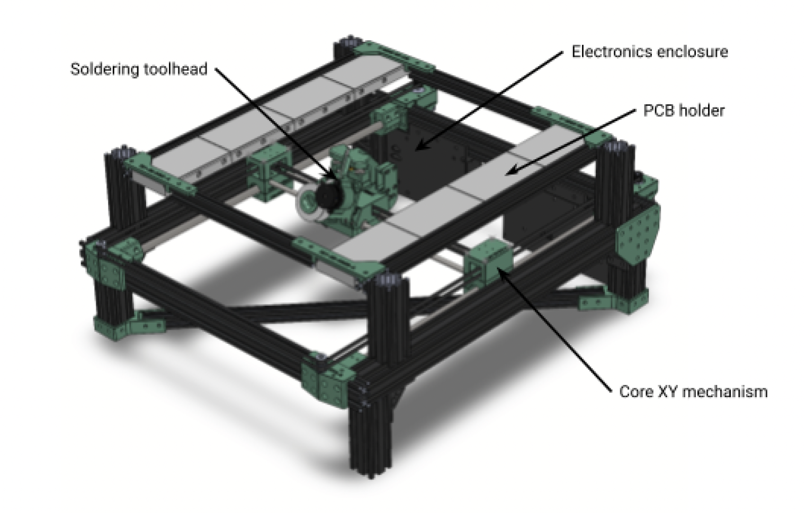
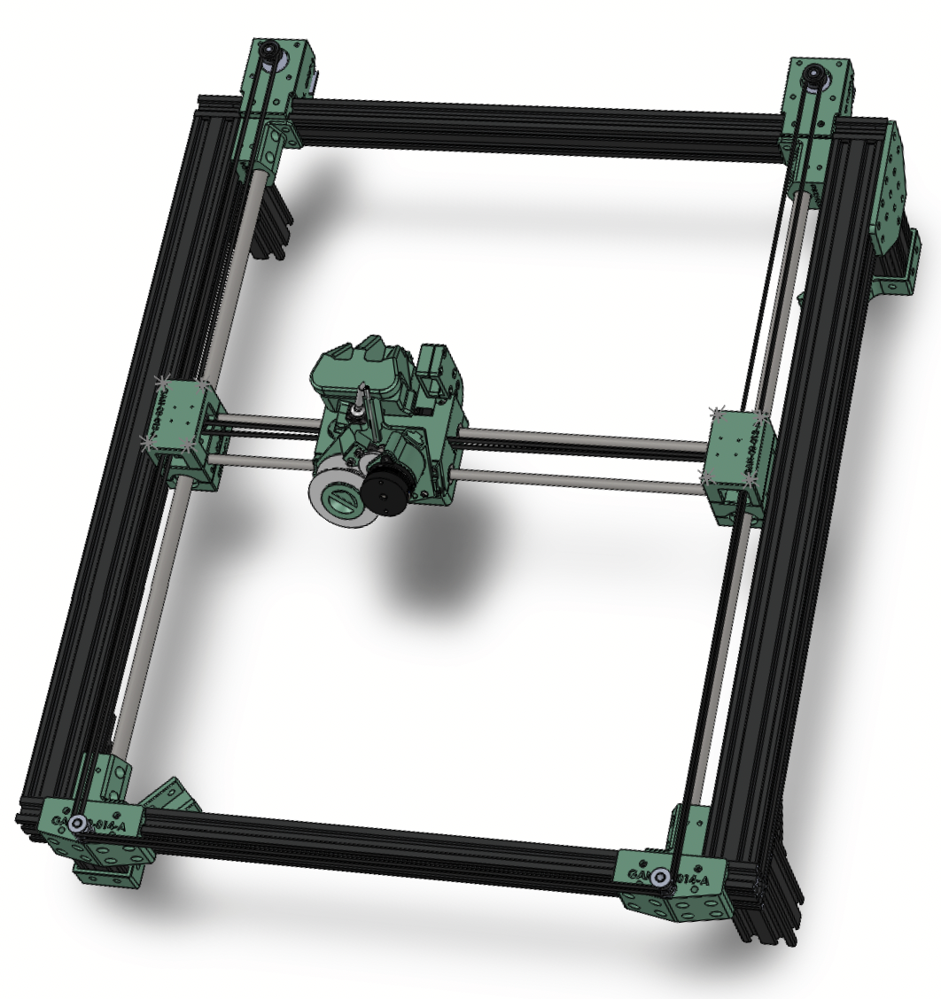
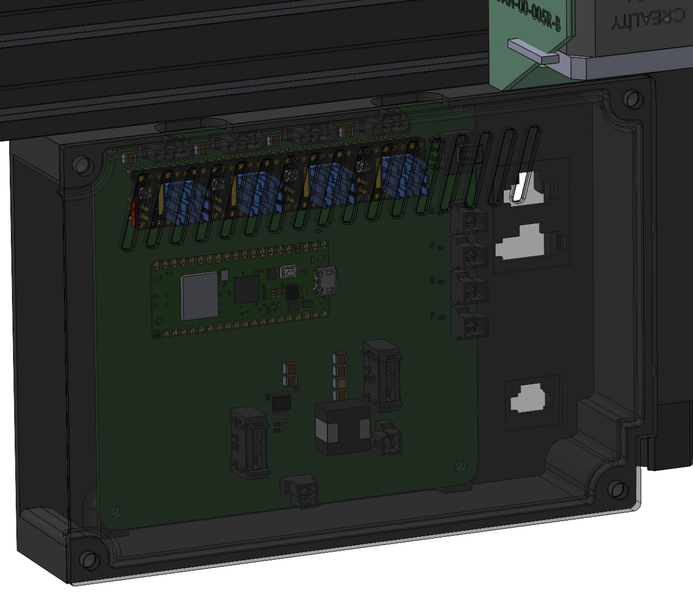
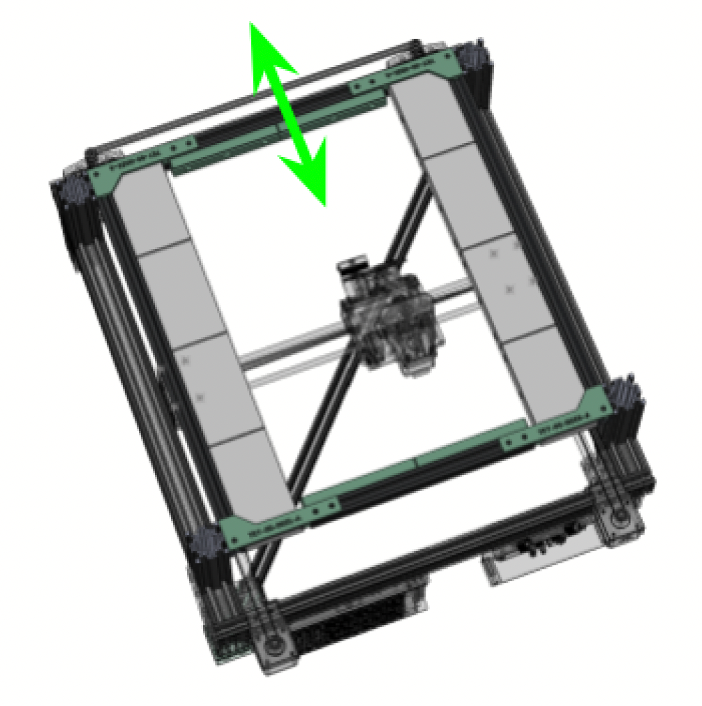
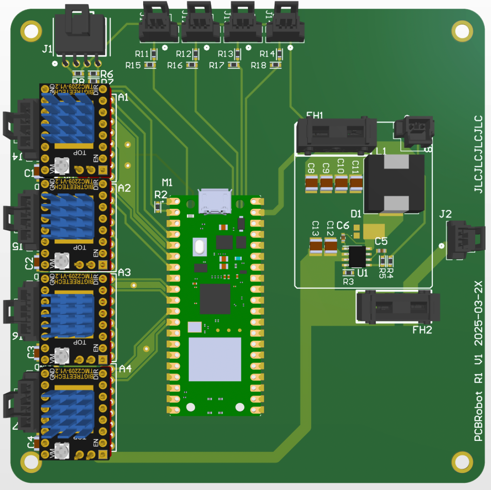
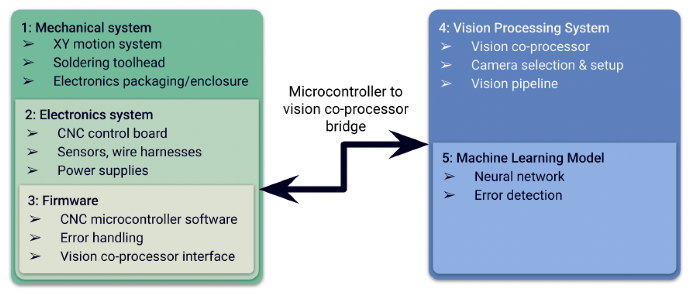
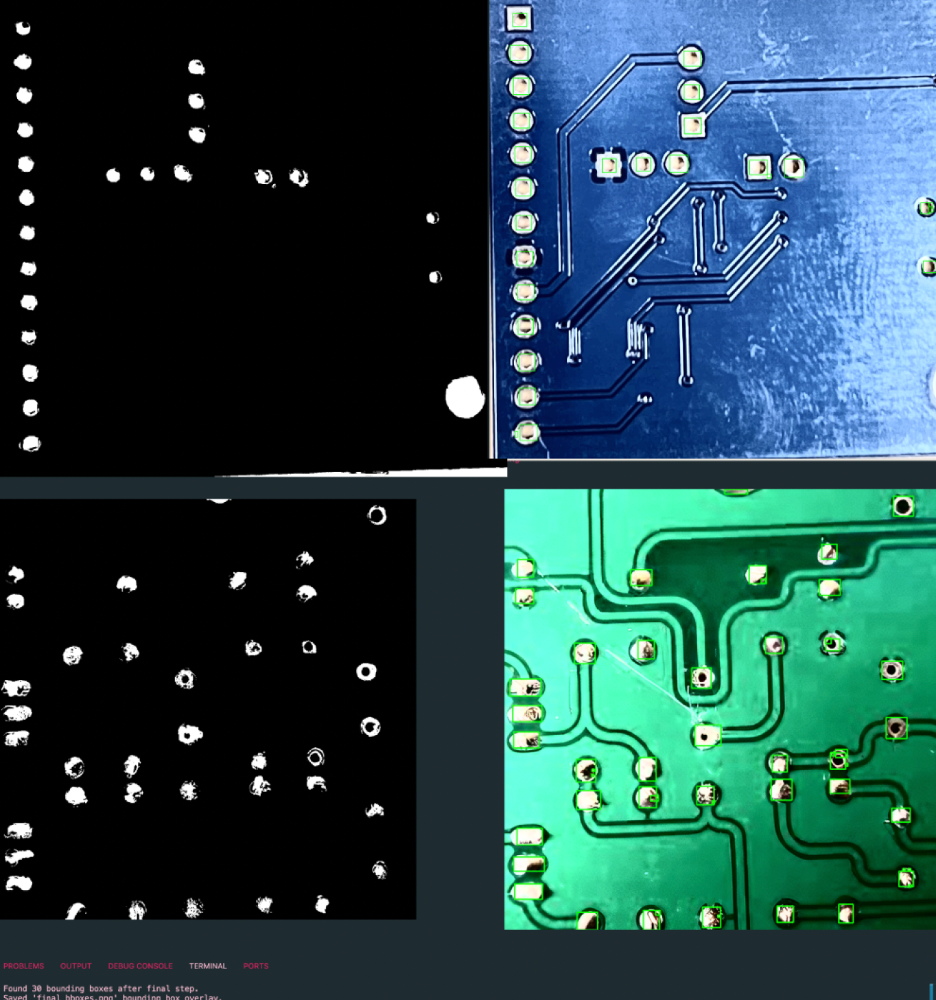
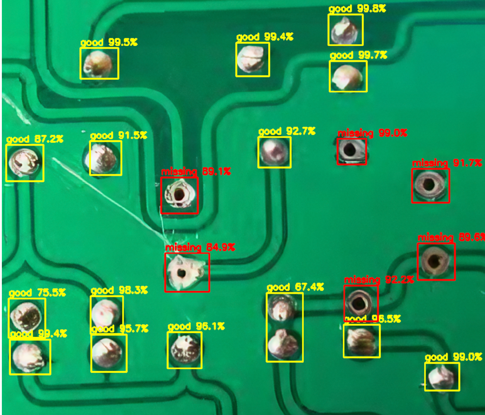
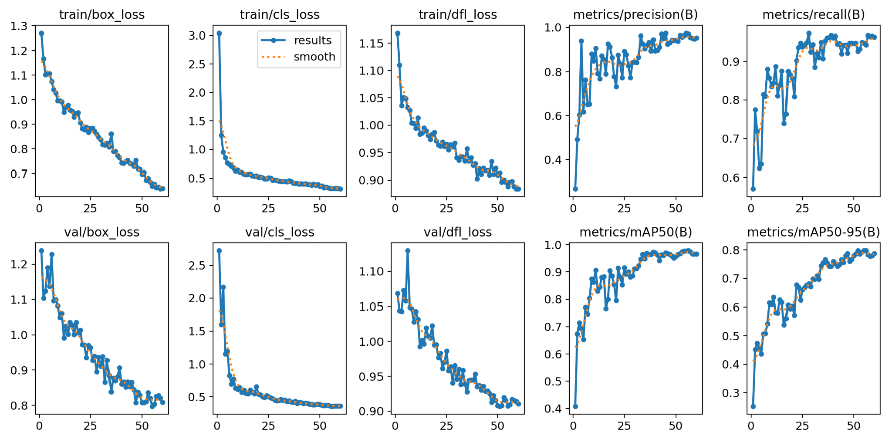
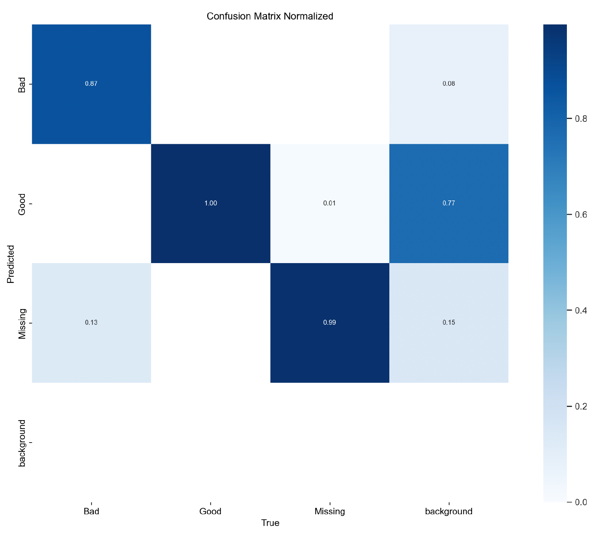

# Autonomous PCB Soldering Robot

## 🤖 Overview

A CoreXY robot that **solders through-hole joints** end-to-end and performs **QA/QC** with a Raspberry Pi vision stack and a **MobileNetV2** classifier (Good / Bad / Missing). Built as a capstone project; **awarded 1st place**.

<!-- Soldering action near the top -->
<video src="assets/videos/soldering_action_960.mp4"
       width="700" autoplay loop muted playsinline></video>
## ✨ Highlights

- **Electromechanical soldering:** CoreXY XY + Z toolhead + motorized solder feed for precise wire advance.
- **Vision + ML QA/QC:** Pi 4 + Pi HQ Camera + 100× microscope lens; MobileNetV2 (TFLite) classifies each joint in ~30 ms.
- **Operator dashboard:** Tkinter GUI overlays labels/confidences, logs CSVs; designed to close the loop to firmware for **auto re-solder**.

---

## 🏭 System Architecture

**Mechanical (CoreXY + Z + feed).**  
Rigid V-slot frame; **12 mm Y-rods** (stiffness), **8 mm X-rods** (low moving mass), GT2 belts. The toolhead integrates a temperature-controlled iron + geared solder-wire feed. An adjustable tray fixtures different PCB sizes consistently.

<table>
  <tr>
    <td align="center">
       <em>Toolhead CAD</em>
    </td>
    <td align="center">
       <em>CoreXY CAD</em>
    </td>
  </tr>
</table>

Additional fixtures:
- **Electronics enclosure** with PSU, regulation and control PCBs  
- **Adjustable PCB tray + tracks** for repeatable placement

**Electronics (motion, power, solder feed).**  
Custom board: **Raspberry Pi Pico** + **TMC2209** drivers. 24 V rail with 5 V buck. **UART** exposes current, microstepping and diagnostics for smooth, consistent motion and gentle feed control.

**Firmware (C++ / PlatformIO).**  
CoreXY kinematics, limit handling, and a **dynamic-derivative** control strategy for smooth starts/stops. We migrated from “variable step” to **variable motor speed** for stability. UART utilities enable driver telemetry and (next rev) closed-loop re-solder from the Pi.

<!-- Axis motion video: paste user-attachments link on its own line -->

[https://github.com/user-attachments/assets/PASTE_AXIS_MOTION_LINK_HERE](https://github.com/user-attachments/assets/3f7d479c-3082-4bf5-9540-0c8854ed8052)

**Vision hardware (Pi coprocessor).**  
**Pi 4 + Pi HQ Camera + 100× lens** at a fixed working distance; **LED ring** fill lighting to reduce glare and stabilize exposure. Data-collection used a legacy camera stack; the final inference GUI runs on newer Pi OS (Picamera2).

---

## 🔬 Vision & ML

**Acquisition & pre-processing.**  
8 MP frames → histogram equalization → **BGR→HSV** → **Otsu** on Hue (to isolate solder) + **V-channel gating** (suppress dim pixels) → median filter → segmentation → **224×224** crops per joint. Robust to lighting and finish variances.

**Classifier (3-class MobileNetV2).**  
TensorFlow Lite **MobileNetV2** (α = 0.75) outputs **Good / Bad / Missing**. Splitting **Missing** from **Bad** clarifies actions: **add solder** (Missing) vs **wick/reflow** (Bad/bridged). The compact model keeps latency low on Pi.

**Operator dashboard.**  
**Tkinter** GUI renders live boxes, per-joint class/confidence, FPS, and logs every decision to CSV. Inputs: **camera / image / video**. Designed to publish UART messages to the Pico for **auto re-solder**.

<!-- Vision setup video: paste user-attachments link on its own line -->
[https://github.com/user-attachments/assets/PASTE_VISION_SETUP_LINK_HERE](https://github.com/user-attachments/assets/72fe943d-a2a2-4d11-bae9-378e5c8d6472)

**Performance.**  
~**30 ms/joint** on Pi 4 with the pre-processing + TFLite pipeline enables practical operator-in-the-loop QA.

---

## ✅ Results
- Repeatable imaging at ~10″ working distance; uniform LED fill reduces glare.  
- Consistent segmentation with accurate 3-class decisions and clear overlays/logs.  
- Full motion + solder-feed proof-of-concept with UART telemetry for safety and tuning.

## ⏳ Next
- **Unify** capture + inference (Picamera2 end-to-end).  
- **Close the loop:** UART-triggered re-solder routines.  
- **Accelerate** on Jetson/Coral; **expand** dataset with more boards/edge-cases.

---

## 🤝 Team
Arji Thaiyib, Arjun Bhatia, **Ahmad Choudhry**, Abdullah Hafeez, Mayar Aljayoush  
Supervisors: Dr. S. Shirani, Dr. C. Chen

## License
Released under the **MIT License** — see [LICENSE](LICENSE).
