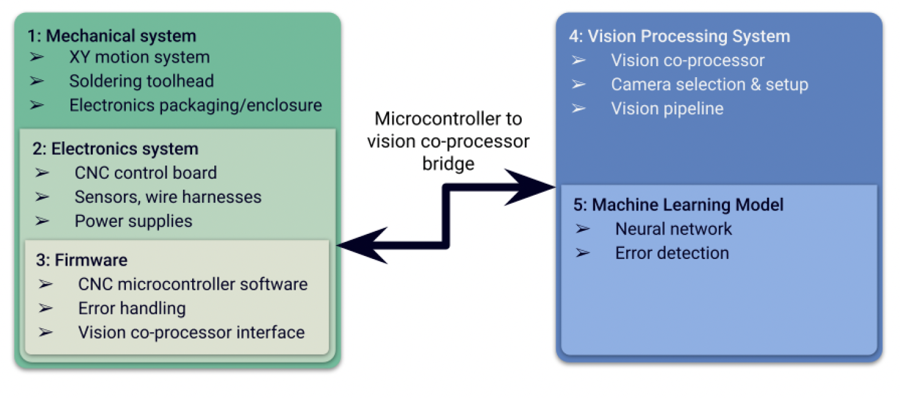
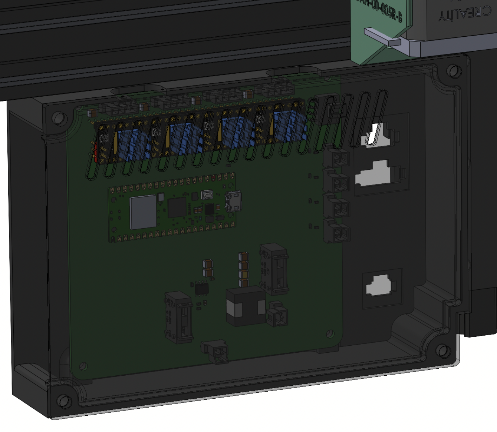

# 🤖 Autonomous PCB Soldering Robot

<!-- Badges -->

  
  
  
  
  
  

  <em>A CNC precision 3-axis automated PCB soldering system with vision processing and AI solder recognition for in-app QA/QC. Built as a capstone project; <strong>awarded 1st place</strong> 🏆</em>

---

<!-- Table of Contents -->

<b>📋 Table of Contents</b>

<ol>
  <li><a href="#-overview">Overview</a></li>
  <li><a href="#-key-features">Key Features</a></li>
  <li><a href="#-system-architecture">System Architecture</a></li>
  <li><a href="#-vision--ml">Vision & ML</a></li>
  <li><a href="#documentation">Documentation</a></li>
  <li><a href="#-technology-stack">Technology Stack</a></li>
  <li><a href="#-results">Results</a></li>
  <li><a href="#-future-possible-upgrades">Future Upgrades</a></li>
  <li><a href="#-team">Team</a></li>
  <li><a href="#-license">License</a></li>
</ol>

---

## 📖 Overview

This project implements an **autonomous PCB soldering robot** that combines precision CNC motion control, computer vision, and deep learning to automate and verify solder joint quality. The system features a **3-axis CoreXY positioning system**, custom electronics, and a **MobileNetV2-based AI classifier** that can detect good, bad, and missing solder joints in real-time.

### 🏆 **Award-Winning Project**
**1st Place** Capstone Project • McMaster University

[🔗 **View Capstone Day Celebration & Expo**](https://www.linkedin.com/feed/update/urn:li:activity:7318740138467962880/)

---

### 🎬 Demonstration Video

<!-- Soldering action (GitHub attachment player). Keep the URL on its own line. -->
https://github.com/user-attachments/assets/3e60dc63-2b64-4922-9cd8-233fcee57446

---

## ✨ Key Features

| 🏭 **Mechanical** | 🔌 **Electronics** | 💾 **Firmware** |
|:---:|:---:|:---:|
| Belt-driven **Core XY** stage with **leadscrew Z-axis** and a stepper-gun solder dispenser for precise wire feed and tip placement | Custom **Altium** PCB integrating **TMC2209** motor drivers, endstops/limit sensors, and a **5 V buck** for regulated logic rails | C++/PlatformIO with **UART** telemetry for current limiting, microstepping and diagnostics; motion planner with **dynamic error handling** and soft-limits |
| 🎥 **Vision** | 🤖 **Machine Learning** | 🖥️ **Application** |
| **Raspberry Pi** + HQ camera under controlled LED ring lighting; manual **bounding-box labeling** of solder joints and dataset augmentation for robustness | Morphological pre-processing + **MobileNetV2** (TFLite) for real-time **Good / Bad / Missing** joint classification | Tkinter GUI with live video/image inputs, overlays, per-joint confidences, and CSV logging for on-the-fly assessment and future **auto re-solder** |

<!-- High-level modules overview for fast context -->

   
  <b>Fig 01.</b> System modules: mechanics, electronics, firmware, vision, ML, and operator app.

---

## 🏭 System Architecture

The system integrates **six major subsystems**: mechanical positioning (CoreXY motion + Z-axis), custom electronics for motion control, firmware for kinematics and safety, computer vision pipeline, machine learning classification, and the operator GUI. Each subsystem is designed for modularity and independent development.

### 🔧 Mechanical (CoreXY + Z + feeder)
Rigid V-slot frame; **12 mm Y-rods** for stiffness, **8 mm X-rods** to reduce moving mass, **GT2 belts** on XY; Z by leadscrew. Toolhead integrates a temperature-controlled iron with a **geared solder-wire feeder**. A kitted tray fixtures boards repeatably.

<!-- Mechanical CAD (stacked) -->

   
  <b>Fig 02 — Toolhead CAD.</b> Iron + geared feeder align wire at the pad; compact, low-mass carriage.

   
  <b>Fig 03 — CoreXY CAD.</b> Symmetric belt routing with idlers; X-rail on 8 mm rods.

 

### Additional fixtures
<table>
  <tr>
    <td align="center" valign="top" width="50%">
       
      <b>Fig 05 — Electronics enclosure.</b> PSU + control PCB; thermal/EMI shielding for stable operation.
    </td>
    <td align="center" valign="top" width="50%">
       
      <b>Fig 06 — Adjustable PCB tray.</b> Hard-stop datums for repeatable imaging and soldering.
    </td>
  </tr>
</table>

### ⚡ Electronics (motion, power, solder feed)
Custom controller: **Raspberry Pi Pico + TMC2209** drivers on a single board; **24 Volt** motion rail with **5 Volt** buck for logic. UART access to driver current, microstepping, and diagnostics enables safe current limits and smooth feeds.

**Key Electronics Features:**
- 🎛️ **TMC2209** silent stepper motor drivers with UART configuration
- 🔋 Dual-rail power supply (24V motion, 5V logic)
- 🛡️ Integrated endstops and limit sensors
- 📊 Real-time telemetry and diagnostics

### 💾 Firmware (C++ / PlatformIO)
- **CoreXY kinematics** and soft/hard limit handling  
- **Variable motor speed** (vs. variable steps) for stable ramps  
- **UART** utilities for telemetry & tuning (foundation for future **auto re-solder**)
- **Dynamic error handling** with safety interlocks

<!-- Axis motion demo in the architecture section -->
https://github.com/user-attachments/assets/a4e11ffc-5575-4b82-93a4-2864e2e326f1

---

## 🔬 Vision & ML

<!-- Move vision demo higher in this section -->
https://github.com/user-attachments/assets/8a706253-764e-4d3b-9e51-ec0bf89ef5b5

### 📸 Acquisition & pre-processing
Lighting-controlled captures (Pi HQ + microscope lens + LED ring) → histogram equalization → **BGR→HSV** → **Otsu** threshold on Hue to isolate solder → **V-channel gating** to drop dim pixels → median filter → morphological cleanup → per-joint crops at **224×224**.

<!-- Vision: pre-processing + inference (larger side-by-side) -->
<table width="100%">
  <tr>
    <td align="center" width="50%">
       
      <b>Fig 09.</b> Equalize → HSV → Otsu(H) → V-gating → median → morph → 224×224 crops.
    </td>
    <td align="center" width="50%">
       
      <b>Fig 10.</b> Overlay of joint boxes with <i>Good/Bad/Missing</i> labels and confidences.
    </td>
  </tr>
</table>

### 🏷️ Labeling & dataset
- **Manual labeling** in LabelImg with rectangular boxes around each solder joint; class set: **Good**, **Bad** (e.g., bridges/voids/insufficient wetting), **Missing** (pad present, solder absent).  
- **Augmentation:** rotations, flips, Gaussian noise, slight blur, exposure jitter, and random spatter/dropout (~×7 expansion) to generalize across pad geometry and lighting.  
- **Splits:** balanced train/val/test with class weights to mitigate skew; crops normalized before inference.

### 🧠 Classifier & training
- **MobileNetV2 (α = 0.75)** in TFLite for low-latency inference on Pi; trained on augmented crops.  
- Loss: categorical cross-entropy with early stopping; metrics tracked per-class to ensure **Missing** stays separable from **Bad**.

<!-- Training plots (stacked for readability) -->

   
  <b>Fig 11.</b> Loss/accuracy vs. epochs; early stopping at convergence.

   
  <b>Fig 12.</b> Clear separation for <i>Missing</i> vs <i>Bad</i>.

### 🖥️ Operator app
Tkinter GUI accepts **camera / image / video** inputs, renders detections with class/confidence, shows FPS, and writes **CSV logs**. Interface is structured to publish UART messages to the Pico for **closed-loop re-solder** in the next revision.

   
  <b>Fig 13.</b> Batch assessment: per-joint labels & confidences across multiple boards; all decisions logged to CSV for QA and future closed-loop re-solder.

---

## 📚 Documentation

For comprehensive technical details, architecture decisions, design rationale, and implementation specifications, refer to the complete **Capstone Final Report**:

📄 **[S05 - Capstone Final Report.pdf](S05%20-%20Capstone%20Final%20Report.pdf)**

This 70+ page report covers:
- 📐 Complete mechanical design and CAD models
- 🔌 Detailed electronics schematics and PCB layout
- 💻 Firmware architecture and motion control algorithms  
- 🧠 ML model development, training methodology, and evaluation
- 📊 Experimental results, testing procedures, and performance metrics
- 🔮 Future work and extension opportunities

---

## 🛠️ Technology Stack

### 🤖 Hardware & Mechanical
- **Motion Control:** CoreXY belt-driven positioning system
- **Actuators:** NEMA 17 stepper motors with TMC2209 drivers
- **Microcontroller:** STM32H503 (ARM Cortex-M33)
- **Vision System:** Raspberry Pi 4 + HQ Camera Module
- **Motion System:** GT2 belts, linear rods (8mm/12mm), leadscrew Z-axis

### 💻 Firmware & Software
- **Firmware:** C++17 with PlatformIO
- **Communications:** UART telemetry for motor control
- **GUI:** Tkinter-based desktop application
- **Computer Vision:** OpenCV for image preprocessing

### 🧠 Machine Learning
- **Model:** MobileNetV2 (α = 0.75) with TensorFlow Lite
- **Training:** Two-phase fine-tuning with data augmentation
- **Framework:** TensorFlow/Keras
- **Preprocessing:** HSV color space, Otsu thresholding, morphological operations

### 🔧 Electronics
- **Design Tool:** Altium Designer for custom PCB
- **Power Management:** 24V motion rail, 5V buck converter
- **Motor Drivers:** TMC2209 with UART configuration
- **Sensing:** Endstops, limit switches, temperature monitoring

### 📊 Data & Labeling
- **Labeling Tool:** LabelImg for bounding box annotation
- **Augmentation:** Rotations, flips, noise, blur, exposure variations (~7x expansion)
- **Dataset:** Balanced train/val/test splits with class weighting

---

## ✅ Results

### 🎯 Key Achievements

| Metric | Performance |
|:---:|:---:|
| 📏 **Imaging Precision** | Repeatable at ~10″ working distance with low-glare LED fill |
| 🤖 **Classification Accuracy** | Robust segmentation + accurate **3-class** decisions |
| 🔗 **System Integration** | Full motion + solder-feed PoC with UART telemetry |
| ⚡ **Real-time Processing** | Live video feed with overlay and CSV logging |
| 🛡️ **Safety Features** | Soft/hard limits, current monitoring, error handling |

**Additional Highlights:**
- ✅ Complete end-to-end pipeline from image capture to quality assessment
- ✅ Modular architecture enabling easy upgrades and modifications  
- ✅ Production-ready GUI with exportable results for QA/QC workflows
- ✅ Comprehensive telemetry system for diagnostics and tuning

## ⏳ Future Possible Upgrades
- 🔄 Unify capture + inference on Picamera2 end-to-end  
- 🔗 Close the loop: UART-triggered re-solder routines  
- ⚡ Accelerate on Jetson/Coral; expand dataset with more boards/edge-cases
- 📊 Real-time analytics dashboard for production monitoring
- 🌐 Web-based interface for remote monitoring

---

## 🤝 Team
Arji Thaiyib, Arjun Bhatia, **Ahmad Ali**, Abdullah Hafeez, Mayar Aljayoush  
Supervisors: Dr. S. Shirani, Dr. C. Chen

---

## 📄 License

This project is licensed under the **MIT License** - see the [LICENSE](LICENSE) file for details.

Made with ❤️ by the PCB Solder Robot Team

